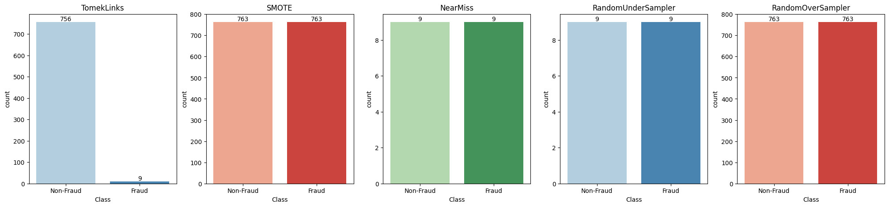
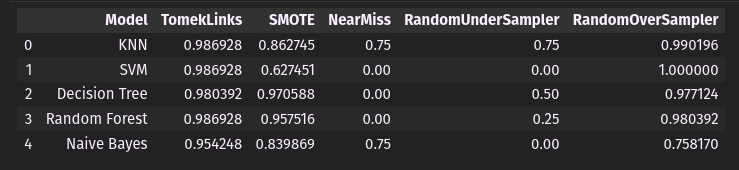
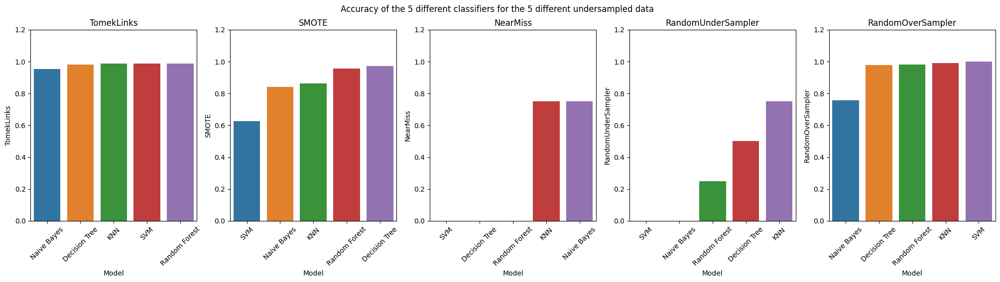

# Credit card fraud detection | EDA and Sampling Techniques

This is a project to detect credit card fraud using machine learning techniques. The dataset is in the repository. The dataset is from Kaggle and can be found [here](https://www.kaggle.com/mlg-ulb/creditcardfraud). I have used sample data for this project. 

## Sampling Techniques used
1. Random Undersampling
2. Random Oversampling
3. SMOTE
4. Tomek Links
5. Near Miss

## Sampled data

## Results

### Accuracy table

### Bar plots of accuracy

